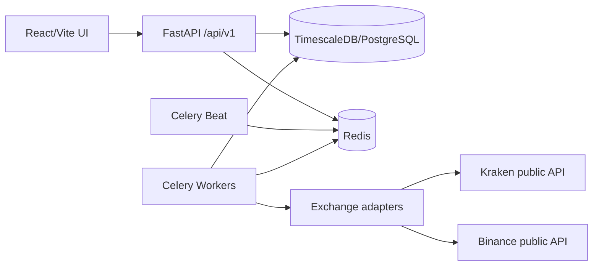

# CryptoPilot Architecture

The backend is a Python 3.12 FastAPI service with Pydantic Settings, SQLAlchemy 2 async sessions, Alembic migrations, structured JSON logging, CORS middleware, dependency injection, typed schemas, and `/health/*` plus `/api/v1/*` routes. The frontend is React, TypeScript, Vite, TanStack Query, Tailwind CSS, and a chart-ready asset page that consumes real API data only.

CCXT is isolated behind `backend/app/exchanges`; application services depend on typed `ExchangeMarket`, `Ticker`, `Candle`, and `ExchangeStatus` domain objects rather than CCXT payloads. Market ingestion flows from Celery/CLI to adapter fetches, validation, idempotent upserts, ingestion-run records, and data-quality events. REST API requests flow through FastAPI routers to async SQLAlchemy queries and typed response models. Background flow uses Celery Beat schedules, Redis broker/result backend, and Redis locks planned for per exchange/market/timeframe overlap prevention.

The database topology is PostgreSQL with TimescaleDB enabled. `candles.opened_at` is the time dimension and the migration converts `candles` into a hypertable. Financial values use `NUMERIC(38,18)` and Python `Decimal`; binary floating-point is not persisted. All timestamps are UTC and timezone-aware at service boundaries.

Data-quality controls validate candle ordering, duplicate timestamps, positive OHLC, high/low consistency, non-negative volume, stale latest candles, missing candles, and exchange failures. Phase 1 stops before prediction and paper trading: future model features and simulated orders must read normalized data through service boundaries. Live trading is explicitly out of scope and will require new security, audit, encryption, activation, and risk-control boundaries.

Deployment is Docker Compose for development: TimescaleDB, Redis, backend, worker, beat, and frontend. Production should split public frontend/API, private workers, managed database/Redis, backups, container scanning, and secret injection through environment or a secret manager.
